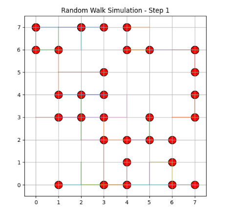

# TA1: Random Walk Simulation Using AgentPy

## 📌 Project Overview
This repository contains a multi-agent simulation developed using Python and the AgentPy library to model random walk behaviors in a grid environment. The primary objective is to observe how agents move, interact, and spread under various spatial constraints and rule modifications. 

This serves as the technical assessment (TA1) for CS0065 (Intelligent Systems), demonstrating the implementation of agent-based models to simulate real-world phenomena such as particle diffusion and crowd congestion.

## 📂 Repository Structure
- `TA1_RandomWalk.ipynb`: The Google Colab Python notebook containing the agent-based model, animation rendering, and CSV export logic.
- `scenario_8agents_15x15_steps30.csv`: The exported final coordinate data for the diffusion/exploration scenario.
- `scenario_40agents_8x8_steps25.csv`: The exported final coordinate data for the crowd congestion scenario.
- `TA1_Pepito.pdf`: The final compiled laboratory report detailing the code, visual outputs, and analytical answers.

## 📊 Simulation Parameters
The simulation environment is dynamically generated based on user inputs. The primary variables controlling the system include:
- **Number of Agents:** Determines the population size within the grid.
- **Grid Size:** Defines the N x N spatial boundaries (agents are mathematically restricted from leaving the grid).
- **Number of Steps:** Controls the time duration of the simulation.

## 🧠 Simulation Mechanics & Scenarios
This project uses `agentpy` for the core model and `matplotlib.animation` to track and visualize agent paths. The standard random walk rules were modified to introduce a **preferred direction**. Instead of equal movement probability, agents were given a weighted bias (50% chance to move right) to observe altered behavioral patterns.

Two contrasting scenarios were executed and compared:
1. **Diffusion Model (8 Agents, 15x15 Grid, 30 Steps):** Simulates gas particles or search drones expanding in an open space, resulting in stretched paths and minimal overlap.
2. **Crowd Dynamics Model (40 Agents, 8x8 Grid, 25 Steps):** Simulates severe congestion in a confined bottleneck, resulting in heavy clustering and multiple agents occupying the exact same coordinates.

## 🚀 Usage Instructions
To reproduce this simulation in your own environment:

1. **Open Environment:** Upload the `.ipynb` file to Google Colab (or run it in a local Jupyter Notebook).
2. **Install Dependencies:** Ensure the required library is installed by running `!pip install agentpy` in a code cell.
3. **Execute the Script:** Run the main simulation cell.
4. **Input Parameters:** When prompted in the console output, type in your desired integer values for the number of agents, grid size, and total steps.
5. **View Results:** The notebook will render an interactive JavaScript HTML animation showing the paths of the agents. It will also automatically generate and save a CSV file containing the final (X, Y) positions of every agent to your current working directory.

## 👤 Author
- [**Alexies Hyro Pepito**](https://github.com/Seixelax)